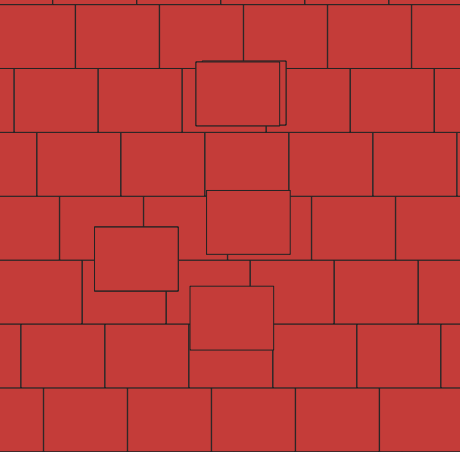

# spatio-temporal-anomaly-detection

Spatio-temporal anomaly detection for Utah air pollution.

## Data preprocess

- The recommended packages for scan stats were on python, so it seems a good idea to transform the data to use easily with python.
- The data was in .rds (R) format, one file per day, without spatial information, and additional .csv files with the grid information.
- The grid was not regular and there were extra cells overlapping each other in certain places. The pixels were defined as rectangles in a .shp file. The grid points were defined in the .csv and align with the center of the pixels.
- To start, it is a good idea to work with 1 variable (PM2.5) and only 1 year (2016). After getting the basics, we can try to scale, transforming more data is just running the same script.

Old Grid:
{: style="height:100px"}
Old Points:
{: style="height:100px"}

Steps to transform the data:

1. Load the .rds and .csv files.
2. Combine them in a geopandas geodataframe with the grid points as the geometry.
3. Rasterize the geometry to create a regular grid of 1km x 1km resolution using the "nearest" method (the pixel takes the value of the closest point).
{: style="height:100px"}
4. Clip the out of bounds pixels, re-project in the correct CRS.
{: style="height:100px"}
5. Add time as dimension and save as .nc file (one per date).
6. Combine all .nc in a 3D .nc file.

## Visualize in QGIS

Follow (roughly) this guide: https://www.geodose.com/2021/03/netcdf-temporal-visualization-qgis.html

For the QGIS temporal controller script part, open the python console,then the pyhton editor, copy paste the `qgis_temp_controller.py` script, then click run (play button) in the python editor, then follow the remaining instructions in the guide to get the animation.

{: style="height:300px"}
